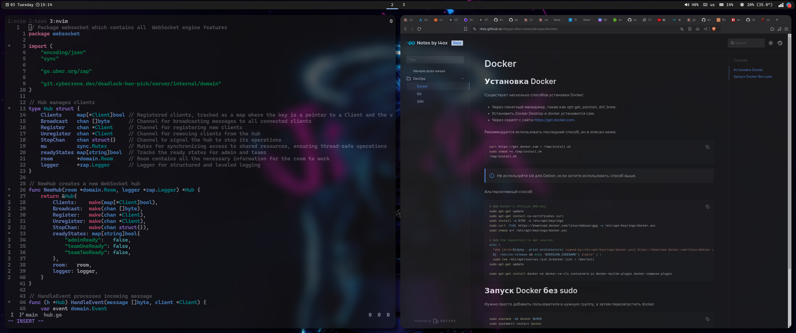
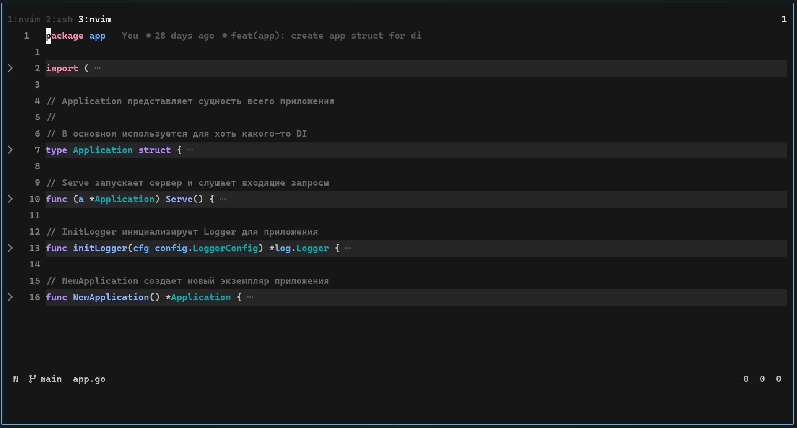
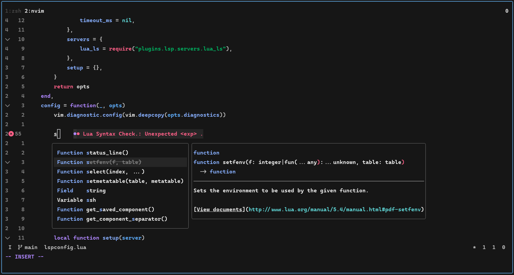
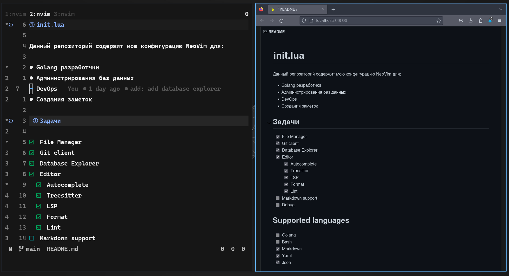
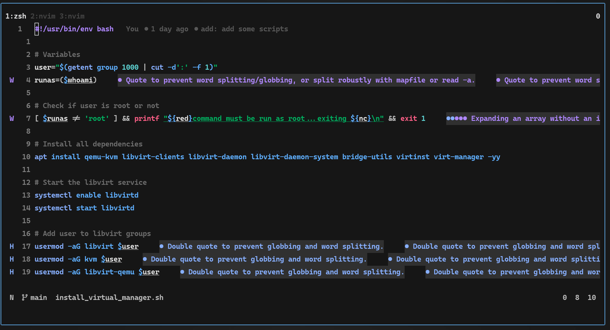

<!--markdownlint-disable  MD041 MD033-->
# This is i3

## NeoVim

### Oil в качестве файлового менеджера

### Neogit в качестве клиента Git

### Vim-Dadbod в качестве менеджера баз данных

Запускается при помощи команды: `DBUIToggle`.

### Telescope для поиска файлов

### Поддержка `Folding` функционала

- **zc** - Свернуть.
- **zo** - Развернуть.
- **zM** - Свернуть все.
- **zR** - Развернуть все.

### Поддержка протокола LSP

### Полная поддержка Markdown

### Полная поддержка Bash

