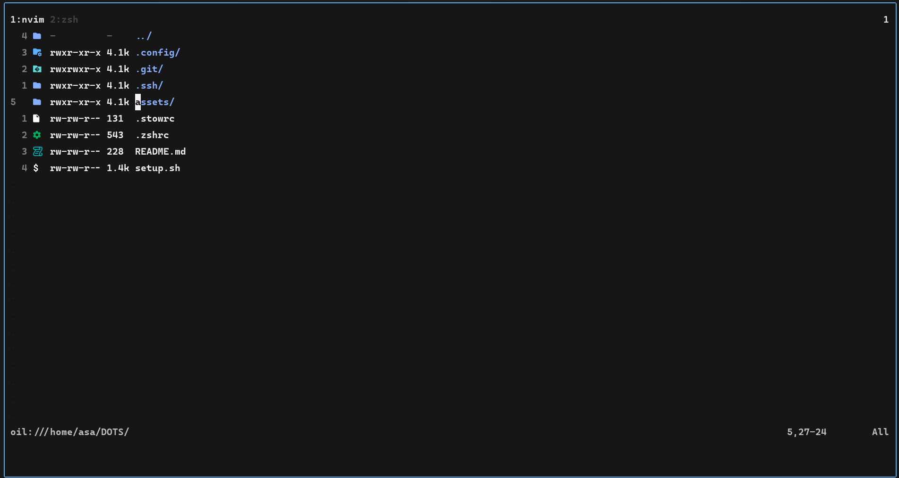
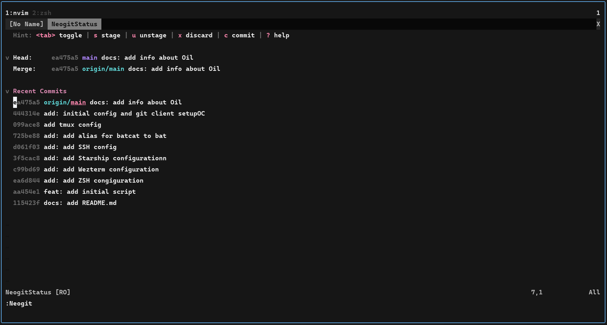
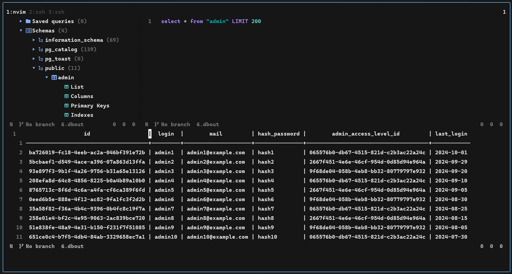
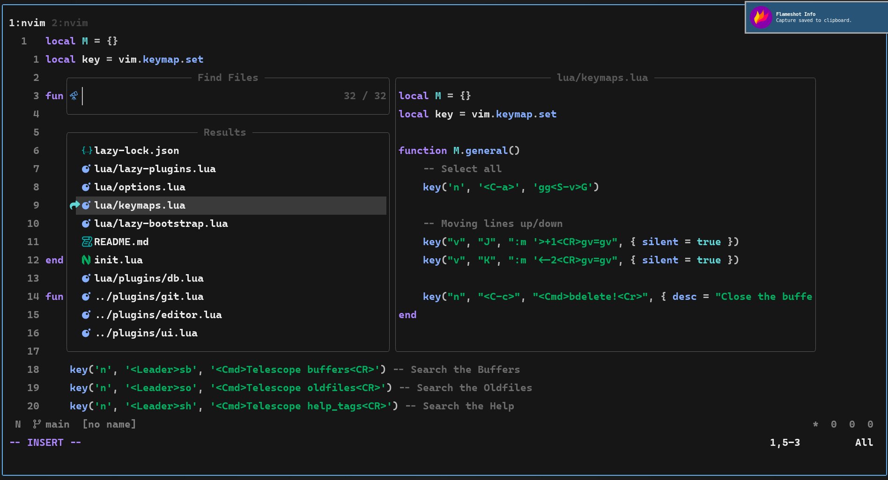

    <h1>[ DEBIAN DOTFILES ]</h1>

## NeoVim

### Oil в качестве файлового менеджера

### Neogit в качестве клиента Git

### Vim-Dadbod в качестве менеджера баз данных

Запускается при помощи команды: `DBUIToggle`.

### Telescope для поиска файлов

